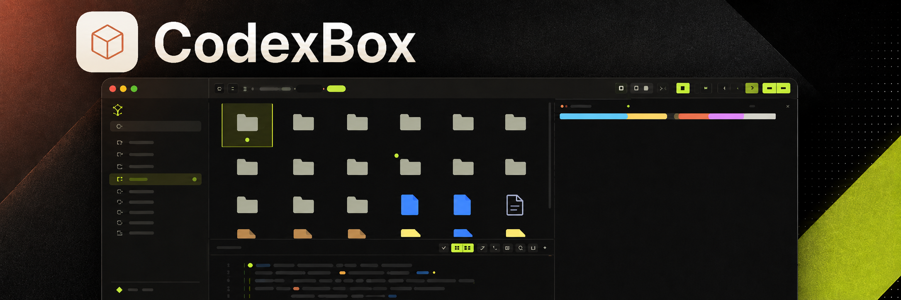
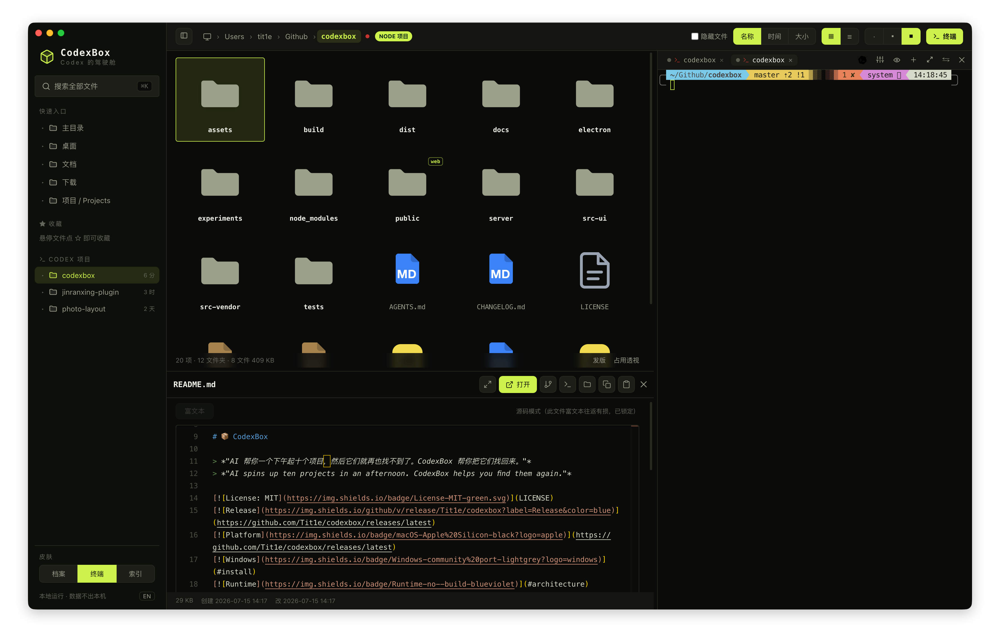
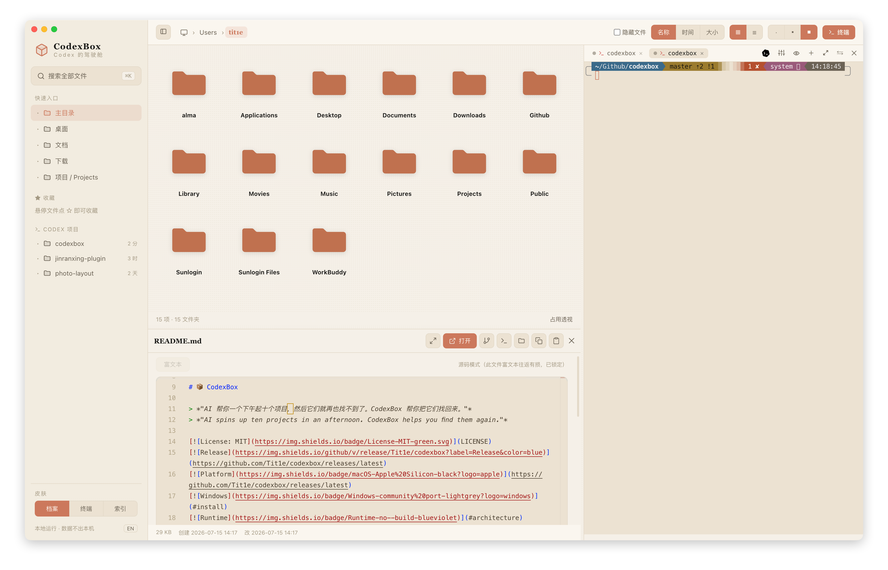
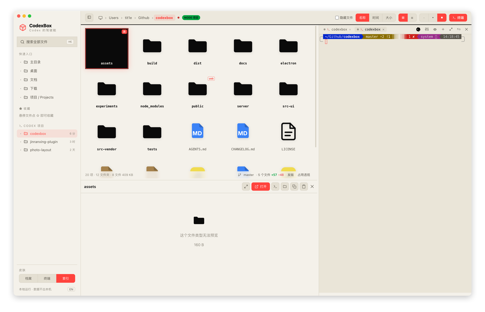

<!--
[INPUT]: 依赖仓库内 assets 产品视觉资源、GitHub Releases 和当前构建运行方式
[OUTPUT]: 对外提供 CodexBox 产品介绍、安装方式、功能说明和开发指南
[POS]: 项目根目录的公开说明文档，是用户与贡献者了解 CodexBox 的首要入口
[PROTOCOL]: 变更时更新此头部，然后检查 AGENTS.md
-->
<div align="center">

# 📦 CodexBox



<br><br>

> *"AI 帮你一个下午起十个项目，然后它们就再也找不到了。CodexBox 帮你把它们找回来。"*
> *"AI spins up ten projects in an afternoon. CodexBox helps you find them again."*

[](LICENSE)
[](https://github.com/Tit1e/codexbox/releases/latest)
[](https://github.com/Tit1e/codexbox/releases/latest)
[](#install)
[](#architecture)

<br>

**CodexBox：Codex 的本地桌面驾驶舱。让 Codex 在本地干活，看清它碰过的每个文件、改过的每一行，随时接手。**<br>
**CodexBox — the local desktop cockpit for Codex: run Codex, see every file and line it changes, and take over anytime.**

<br>

一边浏览、预览、编辑本地文件；一边在内嵌真实终端里跑 Codex。<br>
 Codex 每写一个文件，对应卡片就会亮起来——*找回文件 → 运行 Codex → 看清改了什么*，全部在一个窗口完成。<br>
<br>
Browse, preview and edit local files on one side; run Codex in a real embedded terminal on the other.<br>
Every time Codex writes a file, its card lights up — *find files → run Codex → see what changed*, all in one window.

<br>

[⬇ 下载 dmg / Download dmg](https://github.com/Tit1e/codexbox/releases/latest) · [Screenshots / 截图](#three-skins) · [Features / 功能](#what-it-does) · [Install / 安装](#install) · [Credits / 致谢](#credits)

</div>

---

<p align="center">
  
</p>

<p align="center"><sub>▲ 真机截图：浏览 codexbox 仓库本身，README 原地预览，内嵌终端正在跑 git。本页所有截图均由 Playwright 从实时 App 中直接拍摄，未修图。<br>Real capture: browsing the codexbox repo itself, README previewed in place, git running in the embedded terminal. All screenshots in this README are taken from the live app via Playwright, unedited.</sub></p>

---

<a id="why-codexbox"></a>
## Why CodexBox · 为什么要做 CodexBox

Codex 帮你一个下午起十个项目，但它们散在各处、名字认不出、改了啥看不见。每天的真实流程是：Finder 里翻半天 → 切到 iTerm 启 Codex → 再切浏览器看效果，三个窗口来回跳。

Codex helps you start ten projects in an afternoon — then they scatter everywhere, the names stop making sense, and you can't see what got changed. The daily reality: dig through Finder → switch to iTerm to launch Codex → switch to the browser to check results. Three windows, endless hopping.

CodexBox 把这条链路收进一个窗口：**左边文件 × 右边/下边终端 × 原地预览**，一个有机整体。它不跟 Finder 拼文件操作，不跟 VS Code 拼编辑，专注「找回 + 预览 + 轻改 + 指挥 Codex」这一条链路做到顺手。

CodexBox folds that loop into one window: **files on the left × terminal on the right/bottom × preview in place**. It doesn't compete with Finder on file ops or VS Code on editing. It does one chain well: *find → preview → light edits → command Codex*.

CodexBox 自身不要求云端账号，也没有远程后端，文件浏览与配置都在本机完成。内嵌终端中的 Codex CLI 仍按它自己的账号与网络配置工作。

CodexBox itself has no cloud account or remote backend. File browsing and configuration stay local. The Codex CLI in the embedded terminal still follows its own account and network settings.

<a id="three-skins"></a>
## Three skins · 三套皮肤

三套皮肤不是简单替换主题色：配色、字体、图标、代码高亮和终端 ANSI 主题都会整体变化。

The three skins are not simple color swaps: palette, typography, icons, code highlighting and terminal ANSI themes all change together.

| | |
|---|---|
|  | **终端 · Volt** · 荧光绿 × 炭黑 × 等宽字，工业仪器面板感（默认）<br>**Volt** · neon green × charcoal × monospace, industrial instrument panel (default) |
|  | **档案 · Archive** · 奶油纸 × 赤陶橙 × 衬线，温暖纸感档案馆<br>**Archive** · cream paper × terracotta × serif, a warm paper archive |
|  | **索引 · Index** · 黑白 × 信号红/绿 × 巨号字，编辑式索引日报<br>**Index** · black & white × signal red/green × oversized type, editorial index daily |

<a id="what-it-does"></a>
## What it does · 能做什么

### Files · find & preview / 文件 · 找回与预览

- **⌘K 全局模糊搜索 / Global fuzzy search** — 记得名字片段就行；`⌘↵` 用编辑器整包打开项目；`内容:关键词` 切全文搜索。  
  A fragment of the name is enough; `⌘↵` opens the project in your editor; `content:keyword` switches to full-text search.
- **强色实体图标 / Bold solid icons** — 每种文件「长得像它自己」：PDF 红、JS 黄、Markdown 蓝；照片视频按真实比例呈现。  
  Every file type "looks like itself": red PDFs, yellow JS, blue Markdown; photos and videos render at true aspect ratio.
- **原地预览 / Preview in place** — Markdown 渲染、HTML 实时成品、代码语法高亮、图片/视频/PDF 内嵌（HEIC 直接显示）、压缩包内容清单、透明图棋盘格垫底。  
  Rendered Markdown, live HTML, syntax-highlighted code, inline images/video/PDF (HEIC included), archive content listing, checkerboard backing for transparent images.
- **缩略图缓存 / Cached thumbnails**，图片、视频和 PDF 使用按尺寸生成的本地缩略图，重复打开直接读取缓存。<br>
  Images, videos and PDFs use locally generated, size-aware thumbnails that are reused on later views.
- **项目徽章 / Project badges** — 文件夹卡片标 node / web / py / rs / go 徽章，一下午起的十个项目一眼认出类型。  
  Folder cards show node / web / py / rs / go badges, so ten projects from one afternoon are recognizable at a glance.

### Watch what Codex changed · 看 Codex 改了什么

- **活的仪表盘 / A live dashboard** — Codex 每写一个文件，那张卡片当场荡开涟漪、按改动频率发光呼吸，Codex 写到哪光走到哪。
  Every file Codex writes makes its card ripple and glow by change frequency; the light follows wherever Codex goes.
- **跟随模式 / Follow mode** — 一键让文件视图 + 预览跟踪 Codex 正在编辑的文件：代码随新写行高亮闪烁，HTML 边写边实时渲染（双缓冲、零白闪），Markdown 实时渲染。任何手动浏览立即把控制权交还给你。
  One click and the file view + preview track whatever Codex edits: code scrolls with freshly written lines flashing, HTML renders live as it is written (double-buffered, zero white flash), and Markdown renders live. Any manual browsing hands control back to you instantly.
- **Git 改动 diff / Git diff** — Monaco 只读 DiffEditor 并排展示 HEAD vs 当前工作区，看清 Codex 到底改了哪几行。
  Monaco read-only DiffEditor, HEAD vs working tree side by side.

### Codex cockpit · Codex 驾驶舱

- **内置使用指南 / Built-in guide**，首次启动会介绍核心工作流和常用快捷键，之后可随时通过右上角的 `?` 按钮重新打开。
  The first launch introduces the core workflow and common shortcuts. Reopen the guide anytime from the `?` button at the top right.
- **截图直通车 / Screenshot express** — 系统截屏落盘即浮出直通卡：喂给终端里的 Codex、收进项目 `素材/`、或先标注再发。
  Take a system screenshot and a card pops up in the corner: feed it to Codex, file it into the project's `素材/` (assets) folder, or annotate before sending.
- **AI 整理 / AI organize** — Codex 读取整理 brief 后先提出方案，用户确认才移动文件；每批操作写回滚日志，并沉淀整理偏好。
  Codex reads a generated organize brief, proposes a plan first, and moves files only after approval; every batch writes a rollback log and preserves learned preferences.
- **发版向导 / Release wizard** — node 项目一键串起版本号、CHANGELOG、打包、推送、GitHub Release，整条命令序列在内嵌终端可见地跑。  
  For node projects: version bump, CHANGELOG promotion, build, push and GitHub Release composed into one command sequence that runs visibly in the embedded terminal.
- **磁盘占用透视 / Disk usage lens** — `du` 口径的真实占用条形榜，可下钻，专治「电脑空间又满了」。  
  `du`-accurate bars per folder, drill-down, for the "my disk is full again" moments.

### Terminal · command Codex / 终端 · 指挥 Codex

- **真实内嵌终端 / A real embedded terminal** — node-pty + xterm.js（WebGL 渲染），跑 Codex / vim / htop 不花屏，中文宽字符正确。
  node-pty + xterm.js (WebGL). Codex / vim / htop render correctly, CJK wide characters included.
- **项目运行命令 / Project run commands**：在任意目录保存 `npm run dev` 等命令，子目录自动继承最近规则；服务在规则目录后台运行，顶栏可运行、重启、停止或查看输出，左侧项目列表会显示状态点。
  Save commands such as `npm run dev` in any folder and let child folders inherit the nearest rule. Services run in the configured folder, with top-bar controls and a project-list status dot; open their output only when needed.
- **拖文件进终端 / Drag files in** — 从文件列表拖文件/文件夹进终端，自动插入路径喂给 Codex 当上下文。
  Drop a file or folder into the terminal to insert its path as Codex context.
- **路径可点击 / Clickable paths** — 终端里出现的文件路径直接点击在 CodexBox 打开；带空格的 macOS 截屏名、中文文件名、折行的长路径都能识别（空格边界由文件系统 stat 验证，不靠猜）。
  File paths appearing in terminal output open in CodexBox on click; macOS screenshot names with spaces, Chinese filenames and wrapped long paths are all recognized (space boundaries verified by stat, not guessed).
- **选中即甩给终端 / Send selection** — 预览里选一段文字，一键以「文件出处 + 围栏」格式发进终端（bracketed paste 包裹，不会被逐行误执行）。  
  Select text in a preview and fling it into the terminal with file provenance + fencing (bracketed paste, never executed line by line).
- **态势感知 / Situational awareness** — 标签圆点显示 Codex 运行/空闲/退出；Codex 把球踢回给你时终端边缘呼吸提示「轮到你」，长任务完成发系统通知。
  Tab dots show running/idle/exited; when Codex hands the ball back, the terminal edge breathes; long tasks fire a system notification.
- **Codex 一键启动 / Codex quick launch**，终端工具栏的 Codex 按钮始终在左侧当前目录新建终端标签，默认继续该目录最近的会话，也可在设置中改为新建会话。终端设置同时管理提示音和 WebGL 兼容开关。
  The Codex button in the terminal toolbar always opens a new terminal tab in the current folder on the left. It continues that folder's latest session by default, or starts a new session when selected in settings. Terminal settings also control the chime and WebGL compatibility mode.
- **无参数新会话 / Clean Codex session**，`⌘⇧N` 在左侧当前目录新建终端标签并执行 `codex`，不受“继续最近会话”设置影响。
  `⌘⇧N` opens a new terminal tab in the current folder on the left and runs `codex`, regardless of the continue-latest-session setting.
- **安全重跑命令 / Safe command rerun**，`⌘⇧R` 先停止当前标签的前台任务，确认 Shell 恢复后再执行原命令，适合重启 `npm run dev`、`pnpm dev` 等服务。
  `⌘⇧R` stops the active tab's foreground task, waits for the shell to return, then runs the same command again. It is useful for restarting services such as `npm run dev` or `pnpm dev`.
- **任务恢复 / Task recovery**，退出应用时会确认仍在运行的任务，并保存能够识别的命令；下次启动可选择恢复其中一项或全部恢复。
  When quitting, CodexBox confirms active tasks and saves commands it can identify. On the next launch, restore selected tasks or all of them.
- **合盖继续运行 / Keep running with the lid closed**，可在应用菜单中选择让 Mac 在仍有内嵌终端标签时保持运行；关闭全部终端或退出 CodexBox 后恢复正常休眠。首次开启需要管理员授权。
  An optional app-menu setting keeps the Mac awake while embedded terminal sessions remain open. Normal sleep returns after all terminal tabs close or CodexBox quits. The first activation requires administrator authorization.

### Editing · WYSIWYG / 编辑 · 所见即所得

- **Markdown** — Milkdown Crepe 提供 Notion 式所见即所得，打开就是编辑态，停笔 0.8 秒自动保存。  
  Milkdown Crepe, Notion-style WYSIWYG; opens in edit mode, auto-saves 0.8s after you stop typing.
- **代码/JSON / Code/JSON** — Monaco 编辑器（VS Code 同款内核），随皮肤切换主题。  
  Monaco (the VS Code core), themed per skin.
- **图片标注 / Image annotation** — 画笔/箭头/文字/打码、格式转换、压缩、调分辨率，覆盖原图前有确认。  
  Pen/arrow/text/redaction, format conversion, compression, resizing; overwriting the original asks first.
- **未保存守卫 / Unsaved guard** — 三种编辑器统一拦截未保存退出，Esc 旁路也堵死。  
  All three editors intercept unsaved exits, including the Esc bypass.

<a id="install"></a>
## Install · 安装

### 桌面版（推荐）/ Desktop (recommended)

从 [**Releases**](https://github.com/Tit1e/codexbox/releases/latest) 下载最新 `.dmg`，拖进「应用程序」即可。Apple Silicon (arm64) 原生。

Download the latest `.dmg` from [**Releases**](https://github.com/Tit1e/codexbox/releases/latest) and drag it into Applications. Native Apple Silicon (arm64).

> 已用 Apple Development 证书签名 + hardened runtime。首次打开若提示「未验证的开发者」：**右键 → 打开 → 确认**即可。  
> Signed with an Apple Development certificate + hardened runtime. If macOS warns about an unverified developer on first launch: **right-click → Open → confirm**.
>
> 应用内置**更新提醒**：检测到 GitHub 上有新 Release 时，右下角会显示提示，可直接下载当前架构的 `.dmg` 到「下载」目录并打开，也可前往发布页。不强制更新，可对单个版本关闭提醒。<br>
> Built-in **update notifications** appear at the bottom right when a new GitHub Release is available. Download the `.dmg` for the current architecture directly to Downloads and open it, or visit the release page. Updates are never forced, and individual versions can be muted.

### Windows（社区移植，非官方）/ Windows (community ports, unofficial)

我自己没有 Windows 电脑，没法稳定验证 Windows 版的体验，也不了解 Windows 用户的操作习惯，所以**官方不出 Windows 版**。但社区里有同学基于 CodexBox 拓展了 Windows 版本，想在 Windows 上体验的朋友可以试试，谢谢他们的工作 🙏。

> ⚠️ 这些都不是我的改造，我没有参与开发、也没法对它们的体验和安全负责。请自行评估后使用。

I don't own a Windows machine and can't reliably verify a Windows build or judge what Windows users need, so **there is no official Windows version**. The community has built Windows ports of CodexBox — if you're on Windows, give one a try, and thanks to the maintainers 🙏.

> ⚠️ These are not my builds. I'm not involved in their development and can't vouch for their experience or security. Use at your own discretion.

| 移植 / Port | 链接 / Link |
|---|---|
| daodao166888/fanbox-windows | [Releases](https://github.com/daodao166888/fanbox-windows/releases) |
| cookiesheep/fanbox（v2.3.0 Windows） | [Release](https://github.com/cookiesheep/fanbox/releases/tag/v2.3.0-windows) |

### 网页版（不打包，直接跑）/ Web (no packaging)

```bash
node server.js
```

需要 Node.js 22 或更高版本。浏览器打开 `http://localhost:4567`，无需 `npm install` 或构建。网页版提供文件浏览、搜索和预览；内嵌终端与编辑器需要 Electron 桌面版。

Requires Node.js 22 or newer. Open `http://localhost:4567`; no `npm install` or build step is needed. The web version provides file browsing, search and preview. The embedded terminal and editors require the Electron desktop app.

### 开发模式 / Development

开发环境需要 Node.js 22 或更高版本，Node.js 26 也在支持范围内。

```bash
npm install
npm run dev          # 完整桌面开发：Svelte 自动构建，渲染层刷新，主进程自动重启
npm start            # 网页开发版，默认 4577 / web development server, defaults to 4577
npm run app          # electron . 启动完整桌面版 / full desktop app
npm run dist         # 打包签名 .dmg（产物在 dist/，不入 git）/ build & sign the .dmg (output in dist/)
```

开发入口 `npm start` 和 `npm run app` 默认跑 `http://localhost:4577`（预览服务 `4578`），正式打包版默认跑 `http://localhost:4567`（预览服务 `4568`），避免本机同时开正式版和开发版时端口冲突。开发环境需要手动指定时使用 `CODEXBOX_DEV_PORT=xxxx npm start` 或 `CODEXBOX_DEV_PORT=xxxx npm run app`；正式环境继续使用 `CODEXBOX_PORT`。

`npm run dev` 监听 `src-ui/` 和 `public/`，保存后自动构建并刷新界面；监听 `server/`、`electron/`、`server.js` 和 `port-config.js`，保存后自动重启 Electron。若已有内嵌终端，刷新或重启前会先确认，避免静默终止任务。

`npm install` 只允许 Electron、esbuild 和 node-pty 运行安装脚本。macOS 上的 `postinstall` 会修复 node-pty 辅助程序权限；如果 npm 留下不完整的 Electron 安装，也会使用官方校验信息补全 Electron.app。

> 打包遇到 Electron 下载被墙：`ELECTRON_MIRROR="https://registry.npmmirror.com/-/binary/electron/" npm run dist`

## Shortcuts · 快捷键

| 操作 / Action | 键 / Key | 操作 / Action | 键 / Key |
|---|---|---|---|
| 全局搜索 / Global search | `⌘K` | 用编辑器打开 / Open in editor | `⌘↵` |
| 折叠侧栏 / Toggle sidebar | `⌘B` | 后退 / Back | `⌘[` |
| 启动 Codex（遵循设置）/ Launch Codex | `⌘⇧T` | 新建 Codex 会话 / New Codex session | `⌘⇧N` |
| 新建终端 / New terminal | `⌘T` | 关闭当前终端 / Close terminal | `⌘W` |
| 重新运行当前命令 / Rerun active command | `⌘⇧R` | 当前目录筛选 / Filter current folder | `/` |
| 终端标签 1–8 / Terminal tabs 1–8 | `⌘1`–`⌘8` | 最后一个终端标签 / Last terminal tab | `⌘9` |
| 终端字号 / Terminal font size | `⌘+` `⌘-` `⌘0` | 移动选择 / Move selection | `←` `↑` `↓` `→` |
| 打开或预览 / Open or preview | `↵` | 返回上级目录 / Parent folder | `⌫` |
| 收藏 / Favorite | `Space` | 重命名 / Rename | `F2` |
| 移到废纸篓 / Move to Trash | `⌘⌫` | 关闭 / Close | `Esc` |

<a id="privacy"></a>
## Privacy & security · 隐私与安全

- CodexBox 后端只监听本机回环地址，并校验 Host 与写请求 Origin。文件浏览、收藏、最近记录和应用配置不会上传到 CodexBox 的远程服务。内嵌的 Codex CLI 有独立的联网行为。<br>
  The CodexBox backend listens on loopback only and validates the Host header and write-request Origin. File browsing, favorites, recent items and app configuration are not uploaded to a CodexBox service. The embedded Codex CLI has its own network behavior.
- 浏览器运行所需的前端依赖都随应用放在 `public/`，界面字体使用本机系统字体。CodexBox 的文件浏览与预览可离线使用；检查和下载更新时会访问 GitHub。<br>
  Browser-side dependencies ship with the app under `public/`, while the UI uses local system fonts. CodexBox file browsing and previews work offline; update checks and downloads connect to GitHub.
- HTML 预览由独立端口上的只读 `/` 服务提供，并在沙箱 iframe 中渲染。预览服务限制在用户主目录内且拒绝隐藏路径，页面无法访问主应用 API 或终端桥接。<br>
  HTML previews come from a read-only `/` service on a separate port and render inside a sandboxed iframe. The preview service is limited to non-hidden paths under the home directory, and pages cannot access the main app API or terminal bridge.
- 配置更新使用串行读改写与原子落盘（temp + fsync + rename），避免并发更新互相覆盖或留下截断 JSON。<br>
  Configuration updates use serialized read-modify-write and atomic persistence (temp + fsync + rename), preventing concurrent updates from overwriting one another or leaving truncated JSON.
- 删除走系统废纸篓（可恢复）；缩略图缓存按最旧优先自动裁剪，上限 400MB。  
  Deletions go to the system Trash (recoverable); the thumbnail cache prunes oldest-first with a 400MB cap.

<a id="design"></a>
## Design & verification · 设计与验证

三套皮肤分别围绕终端、档案和编辑索引建立完整的视觉体系。图标采用暖色陶土箱体加米纸 squircle，从 SVG 生成到 icns。

The three skins build complete visual systems around the terminal, archive and editorial-index concepts. The icon is a terracotta archive box on a rice-paper squircle, generated from SVG through icns.

项目早期使用五角色方法做过多轮产品验收，历史标准与结果保存在 `docs/05-验收角色与评分标准.md`。当前代码变更以 `npm run check` 为本地检查入口，并由 GitHub Actions 在 Node.js 22 上重复执行。

The project used a five-role product review method during its early development. The historical criteria and results remain in `docs/05-验收角色与评分标准.md`. Current code changes use `npm run check` locally, with the same command repeated on Node.js 22 in GitHub Actions.

<a id="credits"></a>
## Standing on the shoulders of giants · 建在巨人肩膀上

CodexBox 的核心能力来自这些出色的开源项目：

CodexBox's core capabilities come from these excellent open-source projects:

CodexBox 基于 [alchaincyf/fanbox](https://github.com/alchaincyf/fanbox) 修改而来，感谢原作者花叔开源 FanBox 的基础工作。本 fork 由 Tit1e 维护，继续沿用 MIT 许可；原项目与本项目的版权声明见 [LICENSE](LICENSE)。

CodexBox is based on [alchaincyf/fanbox](https://github.com/alchaincyf/fanbox). Thanks to the original author, Huashu, for open-sourcing the FanBox foundation. This fork is maintained by Tit1e and stays under MIT; see [LICENSE](LICENSE) for both copyright notices.

| 项目 / Project | 用在哪 / Used for | License |
|---|---|---|
| [Electron](https://www.electronjs.org/) | 桌面壳，让零依赖 Node 后端长出真实终端和原生能力<br>The desktop shell that gives a zero-dependency Node backend a real terminal and native powers | MIT |
| [node-pty](https://github.com/microsoft/node-pty) | 伪终端，内嵌终端的「真 shell」来源<br>The pseudo-terminal behind the embedded "real shell" | MIT |
| [xterm.js](https://xtermjs.org/) | 终端渲染（含 [addon-webgl](https://github.com/xtermjs/xterm.js) GPU 加速、addon-fit 自适应、addon-unicode11 CJK 宽字符）<br>Terminal rendering (addon-webgl GPU acceleration, addon-fit, addon-unicode11 for CJK) | MIT |
| [Monaco Editor](https://microsoft.github.io/monaco-editor/) | 代码/JSON 编辑与 Git diff 视图，VS Code 同款内核<br>Code/JSON editing and Git diff view, the VS Code core | MIT |
| [Milkdown](https://milkdown.dev/)（Crepe） | Markdown 所见即所得编辑<br>Markdown WYSIWYG editing | MIT |
| [marked](https://marked.js.org/) | Markdown 预览渲染<br>Markdown preview rendering | MIT |
| [highlight.js](https://highlightjs.org/) | 代码语法高亮<br>Syntax highlighting | BSD-3-Clause |
| [esbuild](https://esbuild.github.io/) | 把 Milkdown 打成单文件本地 vendor，运行时保持 no-build<br>Bundling Milkdown into a single local vendor file, keeping runtime no-build | MIT |
| [electron-builder](https://www.electron.build/) | 打包签名 dmg<br>Packaging and signing the dmg | MIT |
| [Playwright](https://playwright.dev/) | 驱动 Electron 实拍本 README 截图 + UI 验证<br>Driving Electron for README screenshots + UI verification | Apache-2.0 |

浏览器运行所需的依赖都随应用打包在 `public/` 中，文件浏览、预览和编辑不依赖外部 CDN。谢谢这些项目。

Browser-side dependencies ship with the app under `public/`, so file browsing, previews and editing do not depend on an external CDN. Thank you.

<a id="architecture"></a>
## Architecture · 技术架构

| 层 / Layer | 用什么 / Stack |
|---|---|
| 后端 / Backend | Node.js 22+，零依赖 `server.js` 入口 + `server/` 领域服务<br>Node.js 22+, zero-dependency entry + domain services |
| 桌面壳 / Desktop shell | Electron 33.4.11 + node-pty 1.1.0（asarUnpack 原生模块）<br>Electron 33.4.11 + node-pty 1.1.0 (asarUnpack native module) |
| 终端 / Terminal | xterm.js 6.0.0 + WebGL + Unicode 11 |
| 界面 / UI | 原生 ES Module 控制器 + Svelte 5.56.4 渐进界面岛<br>Native ES Module controllers + progressive Svelte 5.56.4 UI islands |
| 编辑器 / Editors | Monaco（代码）+ Milkdown Crepe（Markdown）<br>Monaco (code) + Milkdown Crepe (Markdown) |
| 打包 / Packaging | electron-builder，默认签名 arm64 `.dmg`，另有 x64 构建入口<br>electron-builder, signed arm64 `.dmg` by default, with an x64 build script |

<details>
<summary>项目结构 / Project layout</summary>

```
codexbox/
├── server.js               # 零依赖 Node 后端装配入口 / Backend composition root
├── server/                 # HTTP、文件、媒体、配置和 Codex 会话领域服务
│                           # HTTP, file, media, config and Codex session services
├── electron/
│   ├── main.js             # 主进程装配入口 / Main-process composition root
│   └── preload.js          # 安全渲染桥 / Secure renderer bridge
├── public/
│   ├── index.html
│   ├── app.js              # 原生 ES Module 装配入口 / Native ESM composition root
│   ├── modules/            # 文件、预览、终端和跟随控制器 / Domain controllers
│   ├── styles/             # 按级联顺序拆分的样式 / Ordered style modules
│   ├── generated/          # Svelte 构建产物 / Generated Svelte bundle
│   └── vendor/             # xterm / Monaco / Milkdown 本地资源 / Local browser assets
├── src-ui/                 # Svelte 组件与原生控制器适配层 / Svelte UI islands and adapters
├── src-vendor/             # 浏览器 vendor 包的 esbuild 入口 / esbuild entries for browser vendors
├── build/                  # 开发监督、依赖准备、图标与签名资源 / Dev supervisor, dependency prep and signing assets
├── docs/                   # 产品、架构、验收与故障记录 / Product, architecture, acceptance and incident docs
├── tests/                  # 服务端、Electron 与渲染层测试 / Server, Electron and renderer tests
├── .github/workflows/      # Node.js 22 持续集成 / Node.js 22 CI
└── experiments/            # 实验脚本（含 README 截图脚本）
                            # Experiment scripts (incl. README screenshot script)
```

</details>

---

<div align="center">

**Finder** 帮你管理文件。**IDE** 帮你写代码。**CodexBox** 帮你看清 AI 在你机器上干了什么。<br>
**Finder** manages your files. **IDEs** write your code. **CodexBox** shows you what AI did on your machine.

</div>
